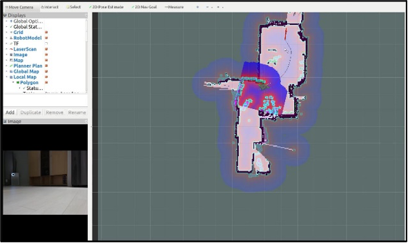

# Drone-and-Robotics
Gachon University 2020 Fall semester

* Introduction : 2020 Fall semester Drone and Robotics Final Project
* Concept : Navigation Turtle bot
* Member : Park Seong Won, Yoo Dong Seop
* Task : Build a map, and navigate the destination

# Algorithm
1. Build a map using user's manual input.
2. Set the start point and destination point.
3. Turtle bot is automatically navigate to the destination.

# Preview
* Map Building

* Navigation

# Video (2020/11/06 Fri.)
* Make Turtle Bot: [Video1](https://youtu.be/0MVXXRaWSxQ)
* Map Building: [Video2](https://drive.google.com/file/d/16fwgHukxxWIACBCbv5pPLArvJXH90ths/view?usp=sharing)
* Navigation: [Video3](https://drive.google.com/file/d/1qaVOjDZr-Q85A_sAbB6Edzm1jkSOOE5L/view?usp=sharing)
* Demo Video: [Video4](https://drive.google.com/file/d/1X6E-v5ac14ctKGcTruY0jHRJaVdckNnJ/view?usp=sharing)

# Environment
* OS: VMware Ubuntu LTS 16.04 in Windows 10
* ROS: ROS-kinetic
* Turtle bot model: Turtle Bot 3
